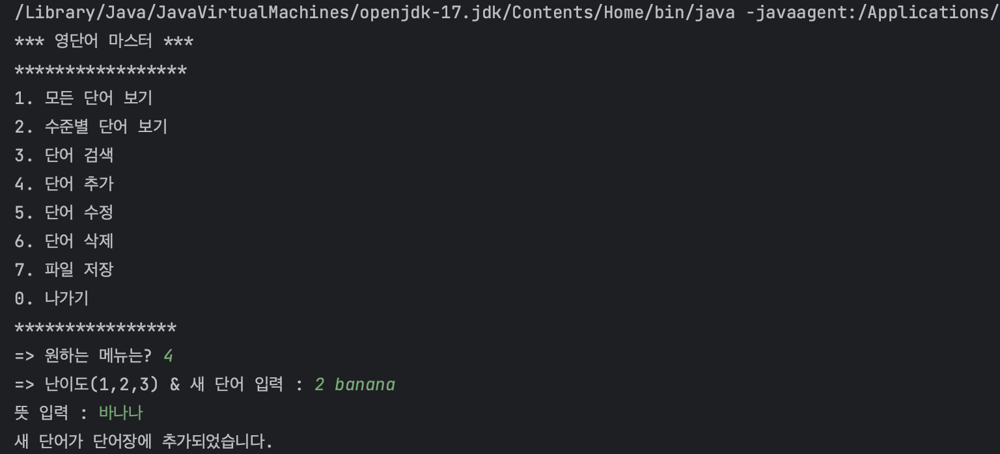
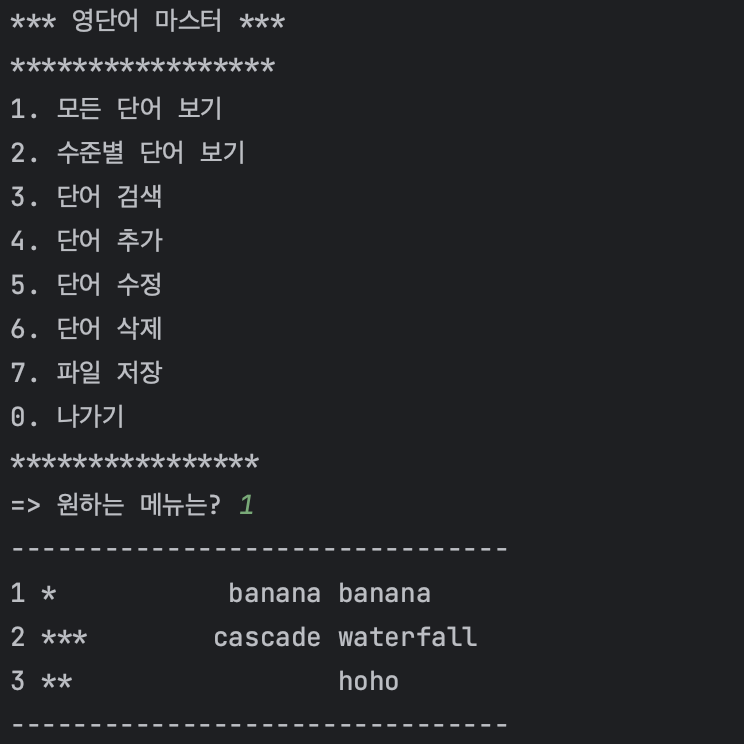

# WordMasterProject
## Project1 진행보고
### 단어장 추가 기능 

### 단어장 조회 기능

## 프로그램 종료 기능

## Project2 진행보고
### 단어장 수정 기능

### 단어장 삭제 기능 

### 단어장 난이도에 따른 검색 기능 

### 단어장 검색 기능 

### 단어장 파일 저장 및 불러오기 기능 

### 저장된 파일 

